# 内部财务系统详细功能清单与业务流程图

## 一、基础设置模块

### 1.1 科目管理

#### 1.1.1 会计科目维护

- 科目新增
  - 录入科目编码（支持自动编码/手动编码）
  - 录入科目名称（中文名称/英文名称）
  - 选择科目类型（资产/负债/权益/成本/损益）
  - 设置科目级次（一级/二级/三级/明细科目）
  - 设置父级科目（下级科目必选）
  - 设置余额方向（借方/贷方）
  - 设置科目状态（启用/停用）
- 科目修改
  - 修改科目名称
  - 修改科目助记码
  - 修改核算币种
  - 修改汇率类型
  - 修改科目备注
  - 记录修改日志（修改人/时间/内容）
- 科目停用
  - 检查科目余额（必须为零）
  - 检查未记账凭证
  - 设置停用日期
  - 停用原因说明
  - 停用审批流程

#### 1.1.2 科目体系设置

- 编码规则设置
  - 设置各级科目编码长度（如4-2-2-2）
  - 设置编码前缀规则
  - 设置自动编码规则
  - 编码唯一性校验
- 科目级次设置
  - 定义科目最大级次（通常4-5级）
  - 设置各级科目权限
  - 设置明细科目标识

#### 1.1.3 辅助核算设置

- 辅助核算项
  - 部门核算
  - 个人往来核算
  - 客户往来核算
  - 供应商往来核算
  - 项目核算
  - 产品核算
  - 自定义核算项（最多10个）
- 数量核算设置
  - 设置数量单位
  - 设置单价小数位
  - 设置数量小数位
  - 设置金额小数位

#### 1.1.4 科目权限管理

- **查看权限**：按角色/用户设置
- **修改权限**：按角色/用户设置
- **删除权限**：仅系统管理员
- **审批权限**：科目变更审批人设置

### 1.2 期初余额

#### 1.2.1 余额录入

- 总账期初
  - 录入各科目期初余额
  - 录入本年借方累计
  - 录入本年贷方累计
  - 录入年初余额
- 明细期初
  - 按辅助核算项录入明细
  - 外币科目录入原币金额
  - 数量科目录入数量
  - 批量导入功能（Excel模板）

#### 1.2.2 试算平衡

- 平衡检查
  - 借贷方余额平衡检查
  - 资产负债表平衡检查
  - 利润表平衡检查
  - 本年利润与未分配利润勾稽
- 差异分析
  - 显示不平衡科目明细
  - 差异金额定位
  - 提供调整建议

#### 1.2.3 期初确认

- **数据锁定**：期初余额确认后锁定
- **审批流程**：主管会计审批
- **修改控制**：确认后修改需特殊权限

### 1.3 币种与汇率

#### 1.3.1 币种设置

- 币种维护
  - 币种代码（如USD、EUR）
  - 币种名称（美元、欧元）
  - 币种符号（$、€）
  - 小数位数设置
  - 默认汇率类型
- 本位币设置
  - 记账本位币（通常为人民币）
  - 报告货币设置
  - 功能货币设置

#### 1.3.2 汇率管理

- 汇率类型
  - 记账汇率
  - 调整汇率
  - 报表汇率
  - 预算汇率
  - 自定义汇率类型
- 汇率维护
  - 日汇率录入
  - 月度汇率设置
  - 汇率批量导入
  - 汇率自动获取（API接口）
  - 汇率变更日志

#### 1.3.3 汇兑损益

- **期末调汇**：自动计算汇兑损益
- **调汇凭证**：自动生成调汇凭证
- **损益科目**：设置汇兑损益科目

### 基础设置模块业务流程图

## 二、日常核算模块

### 2.1 总账管理

#### 2.1.1 凭证处理

##### 凭证录入

- 凭证头信息
  - 凭证日期（默认当前日期）
  - 凭证字号（记/收/付/转）
  - 凭证号（自动编号/手动编号）
  - 附件张数
  - 制单人（自动获取）
  - 制单日期（系统时间）
- 凭证分录
  - 摘要录入（支持常用摘要）
  - 会计科目选择（科目检索/助记码）
  - 借方金额录入
  - 贷方金额录入
  - 辅助核算信息
  - 外币信息（原币/汇率/本币）
  - 数量信息（数量/单价）
- 凭证功能
  - 分录复制/删除
  - 借贷自动平衡
  - 凭证模板保存
  - 凭证草稿保存
  - 红字凭证生成
  - 凭证附件上传（图片/PDF）

##### 凭证审核

- 审核流程
  - 单级审核/多级审核
  - 审核权限设置
  - 批量审核功能
  - 审核意见录入
  - 驳回重新编制
- 审核控制
  - 制单审核分离
  - 跨期审核控制
  - 金额限制审核

##### 凭证记账

- 记账处理
  - 单张记账
  - 批量记账
  - 选择性记账
  - 记账人/时间记录
- 记账控制
  - 按凭证日期顺序
  - 未审核不能记账
  - 跨期记账控制

##### 凭证冲销

- 冲销类型
  - 红字冲销
  - 蓝字冲销
  - 部分冲销
- 冲销控制
  - 冲销原因说明
  - 冲销审批流程
  - 关联原始凭证

#### 2.1.2 账簿查询

##### 总账查询

- 查询条件
  - 会计期间范围
  - 科目范围
  - 科目级次
  - 包含未记账凭证
- 显示内容
  - 期初余额
  - 本期发生额（借/贷）
  - 本期余额
  - 累计发生额
  - 年初余额

##### 明细账查询

- 查询方式
  - 按科目查询
  - 按辅助核算查询
  - 按凭证查询
- 显示内容
  - 凭证日期/字号
  - 摘要
  - 借贷发生额
  - 余额/方向
  - 对方科目

##### 多栏账查询

- 账簿类型
  - 管理费用多栏账
  - 营业收入多栏账
  - 生产成本多栏账
  - 自定义多栏账

##### 日记账查询

- 现金日记账
  - 现金收入/支出明细
  - 每日余额
  - 现金盘点记录
- 银行日记账
  - 银行账户明细
  - 收支流水
  - 银行余额

#### 2.1.3 期末结账

##### 期末处理

- 结转损益
  - 收入类科目结转
  - 成本类科目结转
  - 费用类科目结转
  - 生成结转凭证
- 期末调汇
  - 外币账户重估
  - 汇兑损益计算
  - 调汇凭证生成

##### 结账检查

- 完整性检查
  - 凭证断号检查
  - 凭证审核检查
  - 凭证记账检查
- 准确性检查
  - 试算平衡检查
  - 对账检查
  - 余额检查

##### 月末结账

- 结账处理
  - 期末数据检查
  - 结账确认
  - 下期初始化
  - 结账锁定

### 总账管理业务流程图

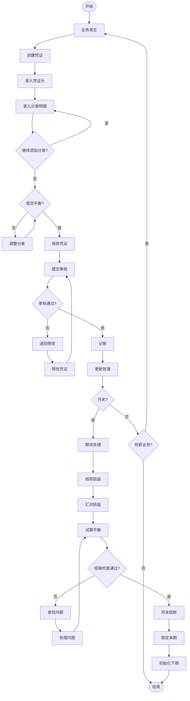

## 三、出纳管理模块

### 3.1 现金管理

#### 3.1.1 现金日记账

- 现金收入
  - 收入日期/时间
  - 收入金额
  - 付款人信息
  - 收入事由
  - 经办人
  - 关联凭证号
- 现金支出
  - 支出日期/时间
  - 支出金额
  - 收款人信息
  - 支出事由
  - 经办人
  - 关联凭证号

#### 3.1.2 现金盘点

- 盘点登记
  - 盘点日期
  - 盘点人员
  - 实盘金额
  - 账面金额
  - 差异金额
  - 差异说明
- 盘点处理
  - 盈亏处理
  - 责任认定
  - 调整凭证

### 3.2 银行账户管理

#### 3.2.1 银行日记账

- 银行收入
  - 收款账户
  - 收入金额
  - 付款单位
  - 银行流水号
  - 到账时间
- 银行支出
  - 付款账户
  - 支出金额
  - 收款单位
  - 银行流水号
  - 付款时间

#### 3.2.2 银行对账

- 对账单导入
  - Excel导入
  - 网银下载
  - API对接
  - 手工录入
- 自动对账
  - 按金额匹配
  - 按日期匹配
  - 按流水号匹配
  - 智能匹配规则
- 手工对账
  - 逐笔勾对
  - 批量勾对
  - 取消勾对

#### 3.2.3 余额调节表

- 未达账项
  - 企业已收银行未收
  - 企业已付银行未付
  - 银行已收企业未收
  - 银行已付企业未付
- 调节结果
  - 调节后余额
  - 差异分析
  - 调节表打印

### 3.3 支票管理

#### 3.3.1 支票申领

- 申领登记
  - 支票类型（现金/转账）
  - 申领数量
  - 起始号码
  - 终止号码
  - 申领人
  - 申领日期

#### 3.3.2 支票开具

- 开票信息
  - 支票号码
  - 收款单位
  - 开票金额
  - 用途说明
  - 开票日期
  - 经办人

#### 3.3.3 支票核销

- 核销登记
  - 使用登记
  - 作废登记
  - 退回登记
  - 遗失登记

### 3.4 资金日报表

#### 3.4.1 日报内容

- 资金收支
  - 当日收入合计
  - 当日支出合计
  - 当日净流入
- 资金余额
  - 现金余额
  - 银行存款余额
  - 总余额

#### 3.4.2 报表生成

- **自动生成**：每日定时生成
- **手工生成**：随时生成
- **报表推送**：邮件/系统推送

### 出纳管理业务流程图

## 四、往来账款模块

### 4.1 应收款管理

#### 4.1.1 销售发票管理

- 发票录入
  - 发票类型（增值税专票/普票）
  - 发票号码
  - 开票日期
  - 客户信息
  - 商品明细
  - 价税信息
  - 付款条件
  - 信用期限
- 发票审核
  - 金额审核
  - 税额审核
  - 客户审核
  - 信用审核

#### 4.1.2 应收账款确认

- 应收登记
  - 客户编码
  - 应收金额
  - 币种汇率
  - 账期设置
  - 到期日期
  - 业务员
  - 部门
- 信用管理
  - 信用额度检查
  - 超信用预警
  - 信用期限控制

#### 4.1.3 收款处理

- 收款登记
  - 收款日期
  - 收款方式
  - 收款金额
  - 银行信息
  - 手续费
  - 备注说明
- 收款核销
  - 按发票核销
  - 按客户核销
  - 部分核销
  - 预收款处理
- 收款确认
  - 财务确认
  - 到账确认
  - 异常处理

#### 4.1.4 坏账管理

- 坏账计提
  - 账龄分析法
  - 余额百分比法
  - 个别认定法
  - 计提比例设置
- 坏账核销
  - 核销申请
  - 核销审批
  - 核销凭证
  - 坏账收回

#### 4.1.5 账龄分析

- 账龄区间
  - 30天以内
  - 31-60天
  - 61-90天
  - 91-180天
  - 181-365天
  - 1年以上
- 分析维度
  - 按客户分析
  - 按业务员分析
  - 按部门分析
  - 按产品分析

#### 4.1.6 客户对账

- 对账单生成
  - 选择对账期间
  - 选择客户范围
  - 包含内容设置
  - 对账单格式
- 对账确认
  - 发送对账单
  - 客户确认
  - 差异处理
  - 对账记录

### 4.2 应付款管理

#### 4.2.1 采购发票管理

- 发票录入
  - 发票类型
  - 供应商信息
  - 采购明细
  - 价税信息
  - 付款条件
- 发票认证
  - 进项税认证
  - 认证期限提醒
  - 认证结果记录

#### 4.2.2 应付账款确认

- 应付登记
  - 供应商编码
  - 应付金额
  - 账期设置
  - 到期日期
  - 采购员
  - 部门

#### 4.2.3 付款管理

- 付款计划
  - 付款排程
  - 资金预算
  - 优先级设置
  - 付款提醒
- 付款申请
  - 申请单填写
  - 附件上传
  - 审批流程
  - 申请跟踪
- 付款审批
  - 多级审批
  - 金额权限
  - 审批意见
  - 驳回处理
- 付款执行
  - 付款方式选择
  - 银行账户选择
  - 付款金额确认
  - 付款凭证生成

#### 4.2.4 付款核销

- 核销方式
  - 按发票核销
  - 按供应商核销
  - 批量核销
  - 预付款核销

#### 4.2.5 供应商对账

- 对账单接收
  - 对账单导入
  - 对账单确认
  - 差异标记
- 差异处理
  - 差异分析
  - 调整处理
  - 争议协商

### 往来账款业务流程图

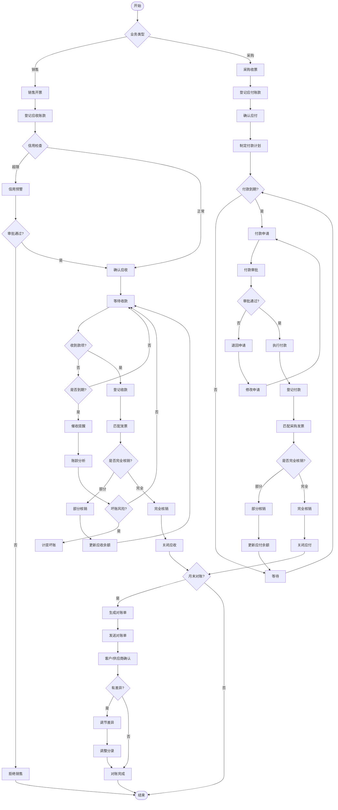

## 五、成本管理模块

### 5.1 成本核算

#### 5.1.1 直接材料成本

- 材料领用
  - 领料单号
  - 领用部门
  - 领用日期
  - 材料编码
  - 材料名称
  - 领用数量
  - 单价/金额
  - 成本对象
- 材料分配
  - 按产品分配
  - 按订单分配
  - 按部门分配
  - 按工序分配
- 材料退库
  - 退库单号
  - 退库数量
  - 退库原因
  - 成本冲减

#### 5.1.2 直接人工成本

- 工时记录
  - 员工编号
  - 工作日期
  - 开始时间
  - 结束时间
  - 工时类型（正常/加班）
  - 成本对象
- 工资分配
  - 工资总额
  - 分配标准（工时/产量）
  - 分配计算
  - 分配结果

#### 5.1.3 制造费用

- 费用归集
  - 折旧费
  - 水电费
  - 维修费
  - 管理人员工资
  - 其他制造费用
- 费用分配
  - 分配标准选择
    - 直接人工工时
    - 机器工时
    - 直接人工成本
    - 直接材料成本
  - 分配率计算
  - 费用分配计算

#### 5.1.4 产品成本计算

- 在产品成本
  - 约当产量计算
  - 完工程度确定
  - 成本分配
- 完工产品成本
  - 完工数量
  - 单位成本
  - 总成本
- 成本结转
  - 结转至产成品
  - 结转至销售成本

### 5.2 成本分析

#### 5.2.1 成本核算方法

- 品种法
  - 按产品品种核算
  - 适用大批量生产
- 分批法
  - 按生产批次核算
  - 适用小批量生产
- 分步法
  - 按生产步骤核算
  - 逐步结转/平行结转

#### 5.2.2 标准成本管理

- 标准设定
  - 材料标准成本
  - 人工标准成本
  - 费用标准成本
- 差异分析
  - 价格差异
  - 数量差异
  - 效率差异
  - 能量差异

#### 5.2.3 成本报表

- **成本汇总表**
- **成本明细表**
- **成本分析表**
- **差异分析表**

### 成本管理业务流程图

## 六、资金管理模块

### 6.1 资金计划

#### 6.1.1 资金预算编制

- 短期资金计划
  - 日资金计划
  - 周资金计划
  - 月资金计划
- 长期资金计划
  - 季度资金计划
  - 年度资金计划
  - 项目资金计划

#### 6.1.2 资金预测

- 流入预测
  - 销售回款预测
  - 其他收入预测
  - 融资流入预测
- 流出预测
  - 采购付款预测
  - 费用支出预测
  - 投资支出预测
- 缺口分析
  - 资金缺口计算
  - 缺口时点分析
  - 融资需求测算

### 6.2 资金调度

#### 6.2.1 收款管理

- 收款方式
  - 现金收款
  - 银行转账
  - 支票收款
  - 承兑汇票
  - 在线支付
- 收款登记
  - 收款单号
  - 付款单位
  - 收款金额
  - 收款账户
  - 到账时间
- 收款核销
  - 关联销售订单
  - 关联应收账款
  - 预收款处理

#### 6.2.2 付款管理

- 付款申请
  - 申请单号
  - 申请部门
  - 申请金额
  - 付款事由
  - 紧急程度
- 付款审批
  - 部门审批
  - 财务审批
  - 领导审批
  - 审批记录
- 付款执行
  - 付款安排
  - 账户选择
  - 付款确认
  - 付款通知

### 6.3 资金监控

#### 6.3.1 资金余额监控

- 实时余额
  - 现金余额
  - 各银行账户余额
  - 可用余额
  - 冻结金额

#### 6.3.2 资金流水查询

- 收支明细
  - 收入明细
  - 支出明细
  - 内部调拨
- 流水分析
  - 按时间分析
  - 按账户分析
  - 按类型分析

#### 6.3.3 资金预警

- 余额预警
  - 最低余额预警
  - 透支预警
- 流动性预警
  - 流动性风险预警
  - 支付能力预警

### 6.4 融资管理

#### 6.4.1 贷款管理

- 贷款登记
  - 贷款机构
  - 贷款金额
  - 贷款期限
  - 利率类型
  - 还款方式
- 利息计算
  - 利息计提
  - 利息支付
  - 利息调整

#### 6.4.2 票据管理

- 票据类型
  - 银行承兑汇票
  - 商业承兑汇票
  - 银行本票
  - 支票
- 票据操作
  - 票据贴现
  - 票据背书
  - 票据托收

#### 6.4.3 担保管理

- 担保登记
  - 担保类型
  - 担保物/人
  - 担保金额
  - 担保期限
- 担保跟踪
  - 担保状态
  - 风险评估
  - 到期提醒

### 资金管理业务流程图

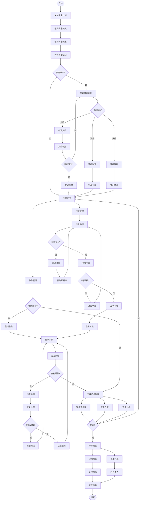

## 七、资产管理模块

### 7.1 固定资产管理

#### 7.1.1 资产录入

- 基本信息
  - 资产编码（自动/手动）
  - 资产名称
  - 资产类别
  - 规格型号
  - 生产厂家
  - 供应商
- 价值信息
  - 原值
  - 残值率
  - 残值
  - 使用年限
  - 已使用月数
- 使用信息
  - 使用部门
  - 使用人
  - 存放地点
  - 启用日期
  - 保管人

#### 7.1.2 折旧管理

- 折旧方法
  - 年限平均法
  - 工作量法
  - 双倍余额递减法
  - 年数总和法
- 折旧计算
  - 月折旧额
  - 累计折旧
  - 净值
  - 折旧调整

#### 7.1.3 资产变动

- 部门转移
  - 转出部门
  - 转入部门
  - 转移日期
  - 审批流程
- 价值变动
  - 原值调整
  - 折旧调整
  - 减值准备
- 其他变动
  - 使用人变更
  - 存放地点变更
  - 使用状态变更

#### 7.1.4 资产盘点

- 盘点计划
  - 盘点范围
  - 盘点时间
  - 盘点人员
- 盘点执行
  - 打印盘点表
  - 实物盘点
  - 录入结果
- 盘点处理
  - 盘盈处理
  - 盘亏处理
  - 差异报告

#### 7.1.5 资产处置

- 处置申请
  - 处置原因
  - 处置方式（报废/出售/捐赠）
  - 预计处置价值
- 处置审批
  - 部门审批
  - 资产管理审批
  - 财务审批
  - 领导审批
- 处置执行
  - 实物处理
  - 账务处理
  - 处置收入
  - 处置损益

### 7.2 无形资产管理

#### 7.2.1 无形资产录入

- 资产信息
  - 资产名称
  - 资产类型（专利/商标/软件/土地使用权）
  - 取得方式
  - 取得日期
  - 初始价值

#### 7.2.2 摊销管理

- 摊销设置
  - 摊销年限
  - 摊销方法
  - 开始摊销日期
- 摊销计算
  - 月摊销额
  - 累计摊销
  - 净值

#### 7.2.3 资产处置

- 处置流程
  - 处置申请
  - 价值评估
  - 处置审批
  - 账务处理

### 资产管理业务流程图

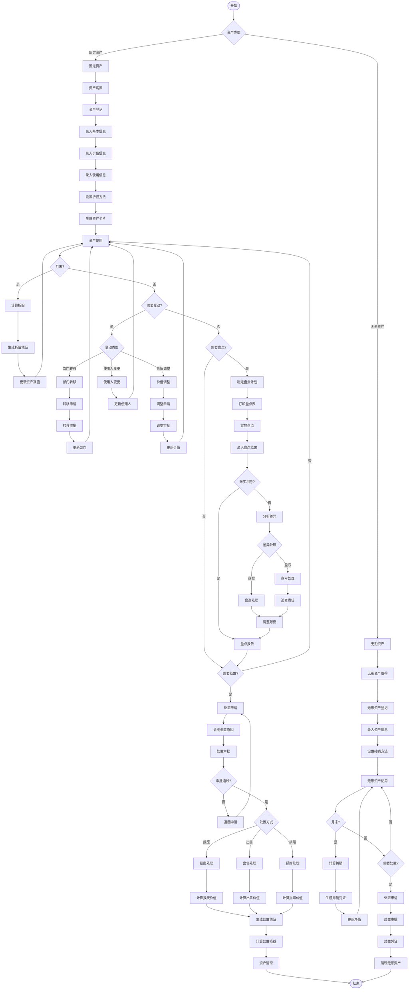

## 八、预算管理模块

### 8.1 预算编制

#### 8.1.1 预算维度设置

- 组织维度
  - 公司级预算
  - 部门级预算
  - 项目级预算
  - 人员级预算
- 时间维度
  - 年度预算
  - 季度预算
  - 月度预算
  - 滚动预算

#### 8.1.2 预算科目设置

- 收入预算科目
  - 主营业务收入
  - 其他业务收入
  - 营业外收入
- 支出预算科目
  - 成本预算
  - 费用预算
  - 资本性支出预算

#### 8.1.3 编制方式

- 自上而下
  - 管理层制定总额
  - 分解到各部门
  - 部门细化分配
- 自下而上
  - 部门编制预算
  - 汇总上报
  - 管理层审批调整
- 上下结合
  - 管理层定目标
  - 部门编制方案
  - 协商确定

#### 8.1.4 预算模板

- 模板定义
  - 预算表格式
  - 计算公式
  - 填报规则
- 模板分发
  - 按部门分发
  - 按项目分发
  - 填报权限控制

### 8.2 预算审批

#### 8.2.1 审批流程

- 提交审批
  - 部门提交
  - 数据校验
  - 完整性检查
- 逐级审批
  - 部门主管审批
  - 财务审批
  - 分管领导审批
  - 总经理审批

#### 8.2.2 审批控制

- 审批权限
  - 金额权限
  - 科目权限
  - 部门权限
- 审批意见
  - 同意/驳回
  - 修改建议
  - 审批记录

### 8.3 预算控制

#### 8.3.1 事前控制

- 预算检查
  - 可用预算检查
  - 预算占用
  - 预算冻结

#### 8.3.2 事中控制

- 执行监控
  - 实时监控
  - 执行率计算
  - 偏差分析
- 预警机制
  - 预警阈值设置（80%/90%/100%）
  - 预警通知方式
  - 预警处理流程

#### 8.3.3 事后分析

- 执行分析
  - 完成率分析
  - 节超分析
  - 原因分析

### 8.4 预算调整

#### 8.4.1 调整申请

- 调整类型
  - 追加预算
  - 调减预算
  - 调剂预算
- 调整原因
  - 业务变化
  - 政策调整
  - 不可抗力

#### 8.4.2 调整审批

- 审批流程
  - 部门申请
  - 财务审核
  - 领导审批
- 调整生效
  - 版本管理
  - 历史记录
  - 调整追踪

### 8.5 预算分析

#### 8.5.1 执行分析

- 执行率分析
  - 整体执行率
  - 部门执行率
  - 项目执行率
  - 科目执行率

#### 8.5.2 差异分析

- 差异计算
  - 绝对差异
  - 相对差异
  - 累计差异
- 原因分析
  - 客观原因
  - 主观原因
  - 改进措施

#### 8.5.3 预算报表

- 标准报表
  - 预算执行情况表
  - 预算差异分析表
  - 预算完成率报表
- 自定义报表
  - 多维度分析
  - 图表展示
  - 导出功能

### 预算管理业务流程图

```mermaid
flowchart TD
    Start([开始]) --> BudgetInit[预算启动]
    BudgetInit --> SetDimension[设置预算维度]
    SetDimension --> SetSubject[设置预算科目]
    SetSubject --> SetTemplate[设置预算模板]
    
    SetTemplate --> DistributeTemplate[分发模板]
    DistributeTemplate --> PrepareMethod{编制方式}
    
    PrepareMethod -->|自上而下| TopDown[管理层制定总额]
    TopDown --> AllocateDept[分解到部门]
    AllocateDept --> DeptDetail[部门细化]
    
    PrepareMethod -->|自下而上| BottomUp[部门编制]
    BottomUp --> DeptSubmit[部门提交]
    DeptSubmit --> Summarize[汇总预算]
    
    PrepareMethod -->|上下结合| Combined[目标下达]
    Combined --> DeptPrepare[部门编制]
    DeptPrepare --> Negotiate[协商调整]
    
    DeptDetail --> SubmitApproval[提交审批]
    Summarize --> SubmitApproval
    Negotiate --> SubmitApproval
    
    SubmitApproval --> DataCheck{数据校验}
    DataCheck -->|不通过| ReturnModify[退回修改]
    ReturnModify --> PrepareMethod
    
    DataCheck -->|通过| FirstApproval[部门主管审批]
    FirstApproval --> FirstResult{审批通过?}
    FirstResult -->|否| ReturnWithComment[退回修改意见]
    ReturnWithComment --> PrepareMethod
    
    FirstResult -->|是| FinanceApproval[财务审批]
    FinanceApproval --> FinanceResult{审批通过?}
    FinanceResult -->|否| ReturnWithComment
    
    FinanceResult -->|是| LeaderApproval[分管领导审批]
    LeaderApproval --> LeaderResult{审批通过?}
    LeaderResult -->|否| ReturnWithComment
    
    LeaderResult -->|是| FinalApproval[总经理审批]
    FinalApproval --> FinalResult{审批通过?}
    FinalResult -->|否| ReturnWithComment
    
    FinalResult -->|是| BudgetEffective[预算生效]
    BudgetEffective --> BudgetExecution[预算执行]
    
    BudgetExecution --> BusinessOccur[业务发生]
    BusinessOccur --> CheckBudget{检查预算}
    
    CheckBudget --> HasBudget{有可用预算?}
    HasBudget -->|否| RejectBusiness[拒绝业务]
    RejectBusiness --> NeedAdjust{需要调整预算?}
    
    NeedAdjust -->|是| AdjustApply[调整申请]
    AdjustApply --> AdjustReason[说明原因]
    AdjustReason --> AdjustApprove[调整审批]
    
    AdjustApprove --> AdjustPass{审批通过?}
    AdjustPass -->|否| RejectAdjust[拒绝调整]
    RejectAdjust --> End
    
    AdjustPass -->|是| UpdateBudget[更新预算]
    UpdateBudget --> BusinessOccur
    
    NeedAdjust -->|否| End
    
    HasBudget -->|是| OccupyBudget[占用预算]
    OccupyBudget --> ExecuteBusiness[执行业务]
    ExecuteBusiness --> UpdateExecution[更新执行数]
    
    UpdateExecution --> CheckThreshold{达到预警阈值?}
    CheckThreshold -->|是| SendAlert[发送预警]
    SendAlert --> AlertHandle[预警处理]
    
    CheckThreshold -->|否| ContinueExecution[继续执行]
    AlertHandle --> ContinueExecution
    
    ContinueExecution --> MonthEnd{月末?}
    MonthEnd -->|否| BusinessOccur
    
    MonthEnd -->|是| ExecutionAnalysis[执行分析]
    ExecutionAnalysis --> CalcRate[计算执行率]
    CalcRate --> VarianceAnalysis[差异分析]
    
    VarianceAnalysis --> FindCause[原因分析]
    FindCause --> GenerateReport[生成报表]
    
    GenerateReport --> BudgetReport[预算执行报表]
    BudgetReport --> YearEnd{年末?}
    
    YearEnd -->|否| NextMonth[进入下月]
    NextMonth --> BusinessOccur
    
    YearEnd -->|是| YearAnalysis[年度分析]
    YearAnalysis --> Performance[绩效考核]
    Performance --> NextYearRef[下年参考]
    NextYearRef --> End([结束])
```

## 九、财务分析模块

### 9.1 盈利能力分析

#### 9.1.1 毛利率分析

- 毛利率计算
  - 销售毛利率 = (销售收入 - 销售成本) / 销售收入
  - 成本毛利率 = (销售收入 - 销售成本) / 销售成本
- 多维度分析
  - 按产品分析
    - 各产品毛利率
    - 产品毛利贡献
    - 产品盈利排名
  - 按客户分析
    - 客户毛利率
    - 客户贡献度
    - 客户分级
  - 按区域分析
    - 区域毛利率
    - 区域对比
  - 按时间分析
    - 月度趋势
    - 同比环比
    - 季节分析

#### 9.1.2 净利率分析

- 净利率指标
  - 销售净利率 = 净利润 / 销售收入
  - 成本费用利润率 = 利润总额 / 成本费用总额
  - 营业利润率 = 营业利润 / 营业收入
- 影响因素分析
  - 收入因素
  - 成本因素
  - 费用因素
  - 税负因素

#### 9.1.3 净资产收益率(ROE)

- ROE计算
  - ROE = 净利润 / 平均净资产
  - 加权平均ROE
- 杜邦分析
  - 净利率分解
  - 总资产周转率分解
  - 权益乘数分解
  - 因素贡献分析

#### 9.1.4 其他盈利指标

- **每股收益(EPS)**
- **息税前利润(EBIT)**
- **息税折旧摊销前利润(EBITDA)**
- **投资回报率(ROI)**

### 9.2 偿债能力分析

#### 9.2.1 短期偿债能力

- 流动比率
  - 流动比率 = 流动资产 / 流动负债
  - 行业对比
  - 趋势分析
  - 预警值设置
- 速动比率
  - 速动比率 = (流动资产 - 存货) / 流动负债
  - 速动资产构成
  - 变现能力分析
- 现金比率
  - 现金比率 = (货币资金 + 交易性金融资产) / 流动负债
  - 现金保障倍数
  - 现金流动负债比

#### 9.2.2 长期偿债能力

- 资产负债率
  - 资产负债率 = 总负债 / 总资产
  - 产权比率 = 总负债 / 所有者权益
  - 权益乘数 = 总资产 / 所有者权益
- 利息保障倍数
  - 利息保障倍数 = EBIT / 利息费用
  - 现金利息保障倍数
  - 固定费用保障倍数

#### 9.2.3 债务结构分析

- 债务期限结构
  - 短期负债占比
  - 长期负债占比
  - 债务到期分布
- 债务类型结构
  - 金融负债
  - 经营负债
  - 或有负债

### 9.3 运营能力分析

#### 9.3.1 应收账款管理

- 应收账款周转率
  - 周转率 = 销售收入 / 平均应收账款
  - 周转天数 = 365 / 周转率
- 回款分析
  - 回款率
  - 回款周期
  - 逾期分析
  - DSO(应收账款周转天数)

#### 9.3.2 存货管理

- 存货周转率
  - 周转率 = 销售成本 / 平均存货
  - 周转天数 = 365 / 周转率
- 存货结构分析
  - 原材料占比
  - 在产品占比
  - 产成品占比
  - 库龄分析

#### 9.3.3 应付账款管理

- 应付账款周转率
  - 周转率 = 采购成本 / 平均应付账款
  - 周转天数 = 365 / 周转率
  - DPO(应付账款周转天数)

#### 9.3.4 营运资本管理

- 营运资本周转
  - 营运资本 = 流动资产 - 流动负债
  - 营运资本周转率
  - 现金转换周期(CCC) = DSO + 存货周转天数 - DPO

#### 9.3.5 总资产管理

- 总资产周转率
  - 周转率 = 销售收入 / 平均总资产
  - 固定资产周转率
  - 流动资产周转率

### 9.4 成长能力分析

#### 9.4.1 收入增长

- 增长率指标
  - 营业收入增长率
  - 主营业务收入增长率
  - 三年平均增长率

#### 9.4.2 利润增长

- 利润增长指标
  - 净利润增长率
  - 营业利润增长率
  - 扣非净利润增长率

#### 9.4.3 资产增长

- 资产增长指标
  - 总资产增长率
  - 净资产增长率
  - 固定资产增长率

### 9.5 现金流分析

#### 9.5.1 现金流结构

- 经营活动现金流
  - 销售商品收到现金
  - 购买商品支付现金
  - 经营现金净流量
- 投资活动现金流
  - 投资支付现金
  - 投资收回现金
  - 投资现金净流量
- 筹资活动现金流
  - 借款收到现金
  - 偿还债务现金
  - 筹资现金净流量

#### 9.5.2 现金流质量

- 现金流量比率
  - 现金流动负债比
  - 现金债务总额比
  - 销售现金比率

### 财务分析业务流程图

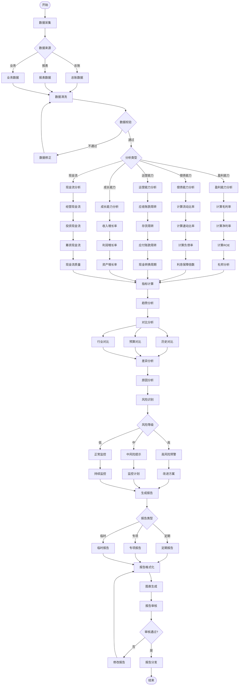

## 十、税务管理模块

### 10.1 税种核算

#### 10.1.1 增值税管理

##### 销项税管理

- 销项税计算
  - 一般计税方法
    - 销项税额 = 销售额 × 税率
    - 税率设置（13%/9%/6%/0%）
  - 简易计税方法
    - 应纳税额 = 销售额 × 征收率
    - 征收率设置（3%/5%）
- 销项发票管理
  - 发票开具登记
    - 发票代码/号码
    - 购方信息
    - 商品明细
    - 价税分离
  - 红字发票处理
  - 作废发票管理

##### 进项税管理

- 进项税认证
  - 认证方式
    - 扫描认证
    - 勾选认证
    - 确认平台认证
  - 认证期限管理
    - 360天认证期限提醒
    - 逾期预警
- 进项发票管理
  - 进项发票登记
  - 发票真伪查验
  - 异常发票处理
  - 失控发票管理

##### 进项税抵扣

- 抵扣管理
  - 当期抵扣
  - 加计抵扣（10%/15%）
  - 不得抵扣项目
    - 用于简易计税项目
    - 用于免税项目
    - 用于个人消费
    - 非正常损失
- 进项税转出
  - 转出原因
  - 转出金额计算
  - 转出凭证生成

##### 增值税申报

- 申报表生成
  - 一般纳税人申报表
    - 主表
    - 附表一（销项）
    - 附表二（进项）
    - 附表三（服务）
    - 附表四（抵扣）
  - 小规模纳税人申报表
- 申报数据校验
  - 账表一致性检查
  - 票表一致性检查
  - 逻辑关系校验

#### 10.1.2 企业所得税

##### 所得税计算

- 应纳税所得额
  - 会计利润
  - 纳税调整增加
    - 超标费用
    - 罚款支出
    - 非公益捐赠
  - 纳税调整减少
    - 免税收入
    - 加计扣除
    - 弥补亏损
- 所得税费用
  - 当期所得税 = 应纳税所得额 × 税率
  - 递延所得税资产/负债
  - 所得税费用合计

##### 所得税优惠

- 税率优惠
  - 小型微利企业（5%/10%）
  - 高新技术企业（15%）
  - 西部大开发（15%）
- 加计扣除
  - 研发费用（175%/200%）
  - 残疾人工资（200%）
  - 安置就业（100%）

##### 所得税申报

- 季度预缴
  - A类申报表
  - B类申报表
- 年度汇算
  - 年度申报表
  - 关联申报表
  - 财务报表

#### 10.1.3 其他税种

##### 城市维护建设税

- 税率：7%/5%/1%
- 计税基础：增值税+消费税

##### 教育费附加

- 税率：3%
- 地方教育附加：2%

##### 印花税

- 税目税率
  - 购销合同（0.03%）
  - 借款合同（0.005%）
  - 产权转移（0.05%）
  - 营业账簿（0.025%）

##### 房产税

- 从价计征
  - 税率：1.2%
  - 计税基础：房产原值×(1-扣除比例)
- 从租计征
  - 税率：12%/4%
  - 计税基础：租金收入

##### 土地使用税

- 按土地等级和面积计算
- 单位税额标准

### 10.2 纳税申报

#### 10.2.1 申报管理

- 申报清单
  - 税种列表
  - 申报期限
  - 申报状态
  - 责任人

#### 10.2.2 申报流程

- 数据准备
  - 自动取数
  - 数据核对
  - 手工调整
- 申报表填写
  - 表格自动生成
  - 公式自动计算
  - 关联数据同步
- 申报提交
  - 数据校验
  - 电子申报
  - 申报回执

#### 10.2.3 申报监控

- 申报提醒
  - 提前提醒
  - 到期提醒
  - 逾期警告
- 申报台账
  - 申报记录
  - 申报凭证
  - 异常处理

### 10.3 税务筹划

#### 10.3.1 筹划方案

- **组织架构筹划**
- **业务模式筹划**
- **税收优惠利用**
- **纳税时间筹划**

#### 10.3.2 风险评估

- **税务风险识别**
- **风险等级评定**
- **风险应对措施**

### 10.4 发票管理

#### 10.4.1 发票开具

- 开票申请
  - 申请单填写
  - 审批流程
  - 开票通知
- 发票开具
  - 税控系统对接
  - 发票打印
  - 发票交付

#### 10.4.2 发票认证

- 认证管理
  - 待认证清单
  - 批量认证
  - 认证结果

#### 10.4.3 发票作废

- 作废流程
  - 作废申请
  - 作废审批
  - 系统作废
  - 作废记录

#### 10.4.4 发票查验

- 真伪查验
  - 税局接口对接
  - 批量查验
  - 异常处理

### 税务管理业务流程图

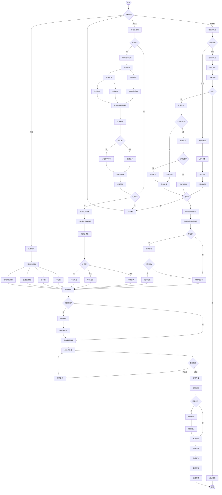

## 三、主要业务流程总结

### 整体业务流程关系

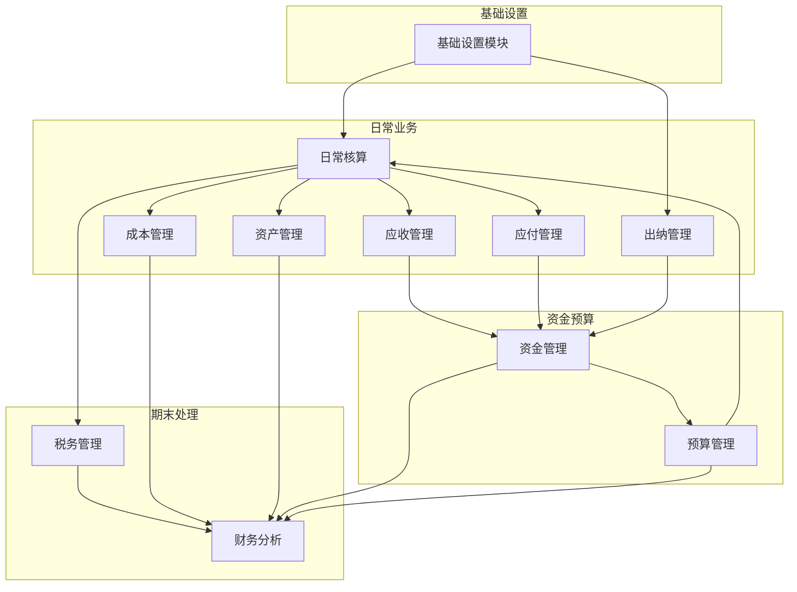

这个详细的功能清单和业务流程图涵盖了财务系统的所有核心模块，每个功能都已细化到最小可实施单元，每个模块都配有完整的业务流程图，确保业务闭环。系统可以按照这个清单进行分阶段开发和实施。# 内部财务系统详细功能清单与业务流程图

## 一、基础设置模块

### 1.1 科目管理

#### 1.1.1 会计科目维护

- 科目新增
  - 录入科目编码（支持自动编码/手动编码）
  - 录入科目名称（中文名称/英文名称）
  - 选择科目类型（资产/负债/权益/成本/损益）
  - 设置科目级次（一级/二级/三级/明细科目）
  - 设置父级科目（下级科目必选）
  - 设置余额方向（借方/贷方）
  - 设置科目状态（启用/停用）
- 科目修改
  - 修改科目名称
  - 修改科目助记码
  - 修改核算币种
  - 修改汇率类型
  - 修改科目备注
  - 记录修改日志（修改人/时间/内容）
- 科目停用
  - 检查科目余额（必须为零）
  - 检查未记账凭证
  - 设置停用日期
  - 停用原因说明
  - 停用审批流程

#### 1.1.2 科目体系设置

- 编码规则设置
  - 设置各级科目编码长度（如4-2-2-2）
  - 设置编码前缀规则
  - 设置自动编码规则
  - 编码唯一性校验
- 科目级次设置
  - 定义科目最大级次（通常4-5级）
  - 设置各级科目权限
  - 设置明细科目标识

#### 1.1.3 辅助核算设置

- 辅助核算项
  - 部门核算
  - 个人往来核算
  - 客户往来核算
  - 供应商往来核算
  - 项目核算
  - 产品核算
  - 自定义核算项（最多10个）
- 数量核算设置
  - 设置数量单位
  - 设置单价小数位
  - 设置数量小数位
  - 设置金额小数位

#### 1.1.4 科目权限管理

- **查看权限**：按角色/用户设置
- **修改权限**：按角色/用户设置
- **删除权限**：仅系统管理员
- **审批权限**：科目变更审批人设置

### 1.2 期初余额

#### 1.2.1 余额录入

- 总账期初
  - 录入各科目期初余额
  - 录入本年借方累计
  - 录入本年贷方累计
  - 录入年初余额
- 明细期初
  - 按辅助核算项录入明细
  - 外币科目录入原币金额
  - 数量科目录入数量
  - 批量导入功能（Excel模板）

#### 1.2.2 试算平衡

- 平衡检查
  - 借贷方余额平衡检查
  - 资产负债表平衡检查
  - 利润表平衡检查
  - 本年利润与未分配利润勾稽
- 差异分析
  - 显示不平衡科目明细
  - 差异金额定位
  - 提供调整建议

#### 1.2.3 期初确认

- **数据锁定**：期初余额确认后锁定
- **审批流程**：主管会计审批
- **修改控制**：确认后修改需特殊权限

### 1.3 币种与汇率

#### 1.3.1 币种设置

- 币种维护
  - 币种代码（如USD、EUR）
  - 币种名称（美元、欧元）
  - 币种符号（$、€）
  - 小数位数设置
  - 默认汇率类型
- 本位币设置
  - 记账本位币（通常为人民币）
  - 报告货币设置
  - 功能货币设置

#### 1.3.2 汇率管理

- 汇率类型
  - 记账汇率
  - 调整汇率
  - 报表汇率
  - 预算汇率
  - 自定义汇率类型
- 汇率维护
  - 日汇率录入
  - 月度汇率设置
  - 汇率批量导入
  - 汇率自动获取（API接口）
  - 汇率变更日志

#### 1.3.3 汇兑损益

- **期末调汇**：自动计算汇兑损益
- **调汇凭证**：自动生成调汇凭证
- **损益科目**：设置汇兑损益科目

### 基础设置模块业务流程图

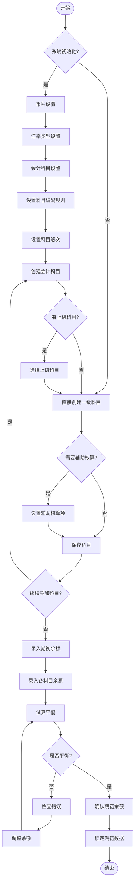

## 二、日常核算模块

### 2.1 总账管理

#### 2.1.1 凭证处理

##### 凭证录入

- 凭证头信息
  - 凭证日期（默认当前日期）
  - 凭证字号（记/收/付/转）
  - 凭证号（自动编号/手动编号）
  - 附件张数
  - 制单人（自动获取）
  - 制单日期（系统时间）
- 凭证分录
  - 摘要录入（支持常用摘要）
  - 会计科目选择（科目检索/助记码）
  - 借方金额录入
  - 贷方金额录入
  - 辅助核算信息
  - 外币信息（原币/汇率/本币）
  - 数量信息（数量/单价）
- 凭证功能
  - 分录复制/删除
  - 借贷自动平衡
  - 凭证模板保存
  - 凭证草稿保存
  - 红字凭证生成
  - 凭证附件上传（图片/PDF）

##### 凭证审核

- 审核流程
  - 单级审核/多级审核
  - 审核权限设置
  - 批量审核功能
  - 审核意见录入
  - 驳回重新编制
- 审核控制
  - 制单审核分离
  - 跨期审核控制
  - 金额限制审核

##### 凭证记账

- 记账处理
  - 单张记账
  - 批量记账
  - 选择性记账
  - 记账人/时间记录
- 记账控制
  - 按凭证日期顺序
  - 未审核不能记账
  - 跨期记账控制

##### 凭证冲销

- 冲销类型
  - 红字冲销
  - 蓝字冲销
  - 部分冲销
- 冲销控制
  - 冲销原因说明
  - 冲销审批流程
  - 关联原始凭证

#### 2.1.2 账簿查询

##### 总账查询

- 查询条件
  - 会计期间范围
  - 科目范围
  - 科目级次
  - 包含未记账凭证
- 显示内容
  - 期初余额
  - 本期发生额（借/贷）
  - 本期余额
  - 累计发生额
  - 年初余额

##### 明细账查询

- 查询方式
  - 按科目查询
  - 按辅助核算查询
  - 按凭证查询
- 显示内容
  - 凭证日期/字号
  - 摘要
  - 借贷发生额
  - 余额/方向
  - 对方科目

##### 多栏账查询

- 账簿类型
  - 管理费用多栏账
  - 营业收入多栏账
  - 生产成本多栏账
  - 自定义多栏账

##### 日记账查询

- 现金日记账
  - 现金收入/支出明细
  - 每日余额
  - 现金盘点记录
- 银行日记账
  - 银行账户明细
  - 收支流水
  - 银行余额

#### 2.1.3 期末结账

##### 期末处理

- 结转损益
  - 收入类科目结转
  - 成本类科目结转
  - 费用类科目结转
  - 生成结转凭证
- 期末调汇
  - 外币账户重估
  - 汇兑损益计算
  - 调汇凭证生成

##### 结账检查

- 完整性检查
  - 凭证断号检查
  - 凭证审核检查
  - 凭证记账检查
- 准确性检查
  - 试算平衡检查
  - 对账检查
  - 余额检查

##### 月末结账

- 结账处理
  - 期末数据检查
  - 结账确认
  - 下期初始化
  - 结账锁定

### 总账管理业务流程图

## 三、出纳管理模块

### 3.1 现金管理

#### 3.1.1 现金日记账

- 现金收入
  - 收入日期/时间
  - 收入金额
  - 付款人信息
  - 收入事由
  - 经办人
  - 关联凭证号
- 现金支出
  - 支出日期/时间
  - 支出金额
  - 收款人信息
  - 支出事由
  - 经办人
  - 关联凭证号

#### 3.1.2 现金盘点

- 盘点登记
  - 盘点日期
  - 盘点人员
  - 实盘金额
  - 账面金额
  - 差异金额
  - 差异说明
- 盘点处理
  - 盈亏处理
  - 责任认定
  - 调整凭证

### 3.2 银行账户管理

#### 3.2.1 银行日记账

- 银行收入
  - 收款账户
  - 收入金额
  - 付款单位
  - 银行流水号
  - 到账时间
- 银行支出
  - 付款账户
  - 支出金额
  - 收款单位
  - 银行流水号
  - 付款时间

#### 3.2.2 银行对账

- 对账单导入
  - Excel导入
  - 网银下载
  - API对接
  - 手工录入
- 自动对账
  - 按金额匹配
  - 按日期匹配
  - 按流水号匹配
  - 智能匹配规则
- 手工对账
  - 逐笔勾对
  - 批量勾对
  - 取消勾对

#### 3.2.3 余额调节表

- 未达账项
  - 企业已收银行未收
  - 企业已付银行未付
  - 银行已收企业未收
  - 银行已付企业未付
- 调节结果
  - 调节后余额
  - 差异分析
  - 调节表打印

### 3.3 支票管理

#### 3.3.1 支票申领

- 申领登记
  - 支票类型（现金/转账）
  - 申领数量
  - 起始号码
  - 终止号码
  - 申领人
  - 申领日期

#### 3.3.2 支票开具

- 开票信息
  - 支票号码
  - 收款单位
  - 开票金额
  - 用途说明
  - 开票日期
  - 经办人

#### 3.3.3 支票核销

- 核销登记
  - 使用登记
  - 作废登记
  - 退回登记
  - 遗失登记

### 3.4 资金日报表

#### 3.4.1 日报内容

- 资金收支
  - 当日收入合计
  - 当日支出合计
  - 当日净流入
- 资金余额
  - 现金余额
  - 银行存款余额
  - 总余额

#### 3.4.2 报表生成

- **自动生成**：每日定时生成
- **手工生成**：随时生成
- **报表推送**：邮件/系统推送

### 出纳管理业务流程图

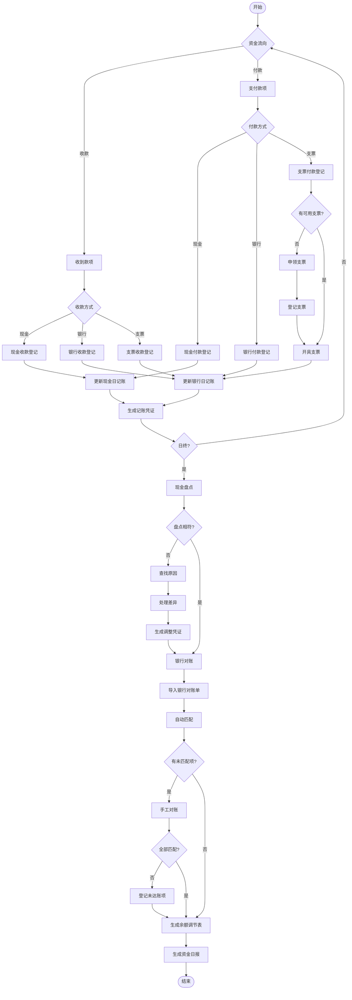

## 四、往来账款模块

### 4.1 应收款管理

#### 4.1.1 销售发票管理

- 发票录入
  - 发票类型（增值税专票/普票）
  - 发票号码
  - 开票日期
  - 客户信息
  - 商品明细
  - 价税信息
  - 付款条件
  - 信用期限
- 发票审核
  - 金额审核
  - 税额审核
  - 客户审核
  - 信用审核

#### 4.1.2 应收账款确认

- 应收登记
  - 客户编码
  - 应收金额
  - 币种汇率
  - 账期设置
  - 到期日期
  - 业务员
  - 部门
- 信用管理
  - 信用额度检查
  - 超信用预警
  - 信用期限控制

#### 4.1.3 收款处理

- 收款登记
  - 收款日期
  - 收款方式
  - 收款金额
  - 银行信息
  - 手续费
  - 备注说明
- 收款核销
  - 按发票核销
  - 按客户核销
  - 部分核销
  - 预收款处理
- 收款确认
  - 财务确认
  - 到账确认
  - 异常处理

#### 4.1.4 坏账管理

- 坏账计提
  - 账龄分析法
  - 余额百分比法
  - 个别认定法
  - 计提比例设置
- 坏账核销
  - 核销申请
  - 核销审批
  - 核销凭证
  - 坏账收回

#### 4.1.5 账龄分析

- 账龄区间
  - 30天以内
  - 31-60天
  - 61-90天
  - 91-180天
  - 181-365天
  - 1年以上
- 分析维度
  - 按客户分析
  - 按业务员分析
  - 按部门分析
  - 按产品分析

#### 4.1.6 客户对账

- 对账单生成
  - 选择对账期间
  - 选择客户范围
  - 包含内容设置
  - 对账单格式
- 对账确认
  - 发送对账单
  - 客户确认
  - 差异处理
  - 对账记录

### 4.2 应付款管理

#### 4.2.1 采购发票管理

- 发票录入
  - 发票类型
  - 供应商信息
  - 采购明细
  - 价税信息
  - 付款条件
- 发票认证
  - 进项税认证
  - 认证期限提醒
  - 认证结果记录

#### 4.2.2 应付账款确认

- 应付登记
  - 供应商编码
  - 应付金额
  - 账期设置
  - 到期日期
  - 采购员
  - 部门

#### 4.2.3 付款管理

- 付款计划
  - 付款排程
  - 资金预算
  - 优先级设置
  - 付款提醒
- 付款申请
  - 申请单填写
  - 附件上传
  - 审批流程
  - 申请跟踪
- 付款审批
  - 多级审批
  - 金额权限
  - 审批意见
  - 驳回处理
- 付款执行
  - 付款方式选择
  - 银行账户选择
  - 付款金额确认
  - 付款凭证生成

#### 4.2.4 付款核销

- 核销方式
  - 按发票核销
  - 按供应商核销
  - 批量核销
  - 预付款核销

#### 4.2.5 供应商对账

- 对账单接收
  - 对账单导入
  - 对账单确认
  - 差异标记
- 差异处理
  - 差异分析
  - 调整处理
  - 争议协商

### 往来账款业务流程图

## 五、成本管理模块

### 5.1 成本核算

#### 5.1.1 直接材料成本

- 材料领用
  - 领料单号
  - 领用部门
  - 领用日期
  - 材料编码
  - 材料名称
  - 领用数量
  - 单价/金额
  - 成本对象
- 材料分配
  - 按产品分配
  - 按订单分配
  - 按部门分配
  - 按工序分配
- 材料退库
  - 退库单号
  - 退库数量
  - 退库原因
  - 成本冲减

#### 5.1.2 直接人工成本

- 工时记录
  - 员工编号
  - 工作日期
  - 开始时间
  - 结束时间
  - 工时类型（正常/加班）
  - 成本对象
- 工资分配
  - 工资总额
  - 分配标准（工时/产量）
  - 分配计算
  - 分配结果

#### 5.1.3 制造费用

- 费用归集
  - 折旧费
  - 水电费
  - 维修费
  - 管理人员工资
  - 其他制造费用
- 费用分配
  - 分配标准选择
    - 直接人工工时
    - 机器工时
    - 直接人工成本
    - 直接材料成本
  - 分配率计算
  - 费用分配计算

#### 5.1.4 产品成本计算

- 在产品成本
  - 约当产量计算
  - 完工程度确定
  - 成本分配
- 完工产品成本
  - 完工数量
  - 单位成本
  - 总成本
- 成本结转
  - 结转至产成品
  - 结转至销售成本

### 5.2 成本分析

#### 5.2.1 成本核算方法

- 品种法
  - 按产品品种核算
  - 适用大批量生产
- 分批法
  - 按生产批次核算
  - 适用小批量生产
- 分步法
  - 按生产步骤核算
  - 逐步结转/平行结转

#### 5.2.2 标准成本管理

- 标准设定
  - 材料标准成本
  - 人工标准成本
  - 费用标准成本
- 差异分析
  - 价格差异
  - 数量差异
  - 效率差异
  - 能量差异

#### 5.2.3 成本报表

- **成本汇总表**
- **成本明细表**
- **成本分析表**
- **差异分析表**

### 成本管理业务流程图

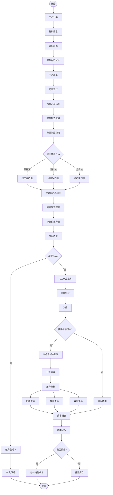

## 六、资金管理模块

### 6.1 资金计划

#### 6.1.1 资金预算编制

- 短期资金计划
  - 日资金计划
  - 周资金计划
  - 月资金计划
- 长期资金计划
  - 季度资金计划
  - 年度资金计划
  - 项目资金计划

#### 6.1.2 资金预测

- 流入预测
  - 销售回款预测
  - 其他收入预测
  - 融资流入预测
- 流出预测
  - 采购付款预测
  - 费用支出预测
  - 投资支出预测
- 缺口分析
  - 资金缺口计算
  - 缺口时点分析
  - 融资需求测算

### 6.2 资金调度

#### 6.2.1 收款管理

- 收款方式
  - 现金收款
  - 银行转账
  - 支票收款
  - 承兑汇票
  - 在线支付
- 收款登记
  - 收款单号
  - 付款单位
  - 收款金额
  - 收款账户
  - 到账时间
- 收款核销
  - 关联销售订单
  - 关联应收账款
  - 预收款处理

#### 6.2.2 付款管理

- 付款申请
  - 申请单号
  - 申请部门
  - 申请金额
  - 付款事由
  - 紧急程度
- 付款审批
  - 部门审批
  - 财务审批
  - 领导审批
  - 审批记录
- 付款执行
  - 付款安排
  - 账户选择
  - 付款确认
  - 付款通知

### 6.3 资金监控

#### 6.3.1 资金余额监控

- 实时余额
  - 现金余额
  - 各银行账户余额
  - 可用余额
  - 冻结金额

#### 6.3.2 资金流水查询

- 收支明细
  - 收入明细
  - 支出明细
  - 内部调拨
- 流水分析
  - 按时间分析
  - 按账户分析
  - 按类型分析

#### 6.3.3 资金预警

- 余额预警
  - 最低余额预警
  - 透支预警
- 流动性预警
  - 流动性风险预警
  - 支付能力预警

### 6.4 融资管理

#### 6.4.1 贷款管理

- 贷款登记
  - 贷款机构
  - 贷款金额
  - 贷款期限
  - 利率类型
  - 还款方式
- 利息计算
  - 利息计提
  - 利息支付
  - 利息调整

#### 6.4.2 票据管理

- 票据类型
  - 银行承兑汇票
  - 商业承兑汇票
  - 银行本票
  - 支票
- 票据操作
  - 票据贴现
  - 票据背书
  - 票据托收

#### 6.4.3 担保管理

- 担保登记
  - 担保类型
  - 担保物/人
  - 担保金额
  - 担保期限
- 担保跟踪
  - 担保状态
  - 风险评估
  - 到期提醒

### 资金管理业务流程图

## 七、资产管理模块

### 7.1 固定资产管理

#### 7.1.1 资产录入

- 基本信息
  - 资产编码（自动/手动）
  - 资产名称
  - 资产类别
  - 规格型号
  - 生产厂家
  - 供应商
- 价值信息
  - 原值
  - 残值率
  - 残值
  - 使用年限
  - 已使用月数
- 使用信息
  - 使用部门
  - 使用人
  - 存放地点
  - 启用日期
  - 保管人

#### 7.1.2 折旧管理

- 折旧方法
  - 年限平均法
  - 工作量法
  - 双倍余额递减法
  - 年数总和法
- 折旧计算
  - 月折旧额
  - 累计折旧
  - 净值
  - 折旧调整

#### 7.1.3 资产变动

- 部门转移
  - 转出部门
  - 转入部门
  - 转移日期
  - 审批流程
- 价值变动
  - 原值调整
  - 折旧调整
  - 减值准备
- 其他变动
  - 使用人变更
  - 存放地点变更
  - 使用状态变更

#### 7.1.4 资产盘点

- 盘点计划
  - 盘点范围
  - 盘点时间
  - 盘点人员
- 盘点执行
  - 打印盘点表
  - 实物盘点
  - 录入结果
- 盘点处理
  - 盘盈处理
  - 盘亏处理
  - 差异报告

#### 7.1.5 资产处置

- 处置申请
  - 处置原因
  - 处置方式（报废/出售/捐赠）
  - 预计处置价值
- 处置审批
  - 部门审批
  - 资产管理审批
  - 财务审批
  - 领导审批
- 处置执行
  - 实物处理
  - 账务处理
  - 处置收入
  - 处置损益

### 7.2 无形资产管理

#### 7.2.1 无形资产录入

- 资产信息
  - 资产名称
  - 资产类型（专利/商标/软件/土地使用权）
  - 取得方式
  - 取得日期
  - 初始价值

#### 7.2.2 摊销管理

- 摊销设置
  - 摊销年限
  - 摊销方法
  - 开始摊销日期
- 摊销计算
  - 月摊销额
  - 累计摊销
  - 净值

#### 7.2.3 资产处置

- 处置流程
  - 处置申请
  - 价值评估
  - 处置审批
  - 账务处理

### 资产管理业务流程图

## 八、预算管理模块

### 8.1 预算编制

#### 8.1.1 预算维度设置

- 组织维度
  - 公司级预算
  - 部门级预算
  - 项目级预算
  - 人员级预算
- 时间维度
  - 年度预算
  - 季度预算
  - 月度预算
  - 滚动预算

#### 8.1.2 预算科目设置

- 收入预算科目
  - 主营业务收入
  - 其他业务收入
  - 营业外收入
- 支出预算科目
  - 成本预算
  - 费用预算
  - 资本性支出预算

#### 8.1.3 编制方式

- 自上而下
  - 管理层制定总额
  - 分解到各部门
  - 部门细化分配
- 自下而上
  - 部门编制预算
  - 汇总上报
  - 管理层审批调整
- 上下结合
  - 管理层定目标
  - 部门编制方案
  - 协商确定

#### 8.1.4 预算模板

- 模板定义
  - 预算表格式
  - 计算公式
  - 填报规则
- 模板分发
  - 按部门分发
  - 按项目分发
  - 填报权限控制

### 8.2 预算审批

#### 8.2.1 审批流程

- 提交审批
  - 部门提交
  - 数据校验
  - 完整性检查
- 逐级审批
  - 部门主管审批
  - 财务审批
  - 分管领导审批
  - 总经理审批

#### 8.2.2 审批控制

- 审批权限
  - 金额权限
  - 科目权限
  - 部门权限
- 审批意见
  - 同意/驳回
  - 修改建议
  - 审批记录

### 8.3 预算控制

#### 8.3.1 事前控制

- 预算检查
  - 可用预算检查
  - 预算占用
  - 预算冻结

#### 8.3.2 事中控制

- 执行监控
  - 实时监控
  - 执行率计算
  - 偏差分析
- 预警机制
  - 预警阈值设置（80%/90%/100%）
  - 预警通知方式
  - 预警处理流程

#### 8.3.3 事后分析

- 执行分析
  - 完成率分析
  - 节超分析
  - 原因分析

### 8.4 预算调整

#### 8.4.1 调整申请

- 调整类型
  - 追加预算
  - 调减预算
  - 调剂预算
- 调整原因
  - 业务变化
  - 政策调整
  - 不可抗力

#### 8.4.2 调整审批

- 审批流程
  - 部门申请
  - 财务审核
  - 领导审批
- 调整生效
  - 版本管理
  - 历史记录
  - 调整追踪

### 8.5 预算分析

#### 8.5.1 执行分析

- 执行率分析
  - 整体执行率
  - 部门执行率
  - 项目执行率
  - 科目执行率

#### 8.5.2 差异分析

- 差异计算
  - 绝对差异
  - 相对差异
  - 累计差异
- 原因分析
  - 客观原因
  - 主观原因
  - 改进措施

#### 8.5.3 预算报表

- 标准报表
  - 预算执行情况表
  - 预算差异分析表
  - 预算完成率报表
- 自定义报表
  - 多维度分析
  - 图表展示
  - 导出功能

### 预算管理业务流程图

